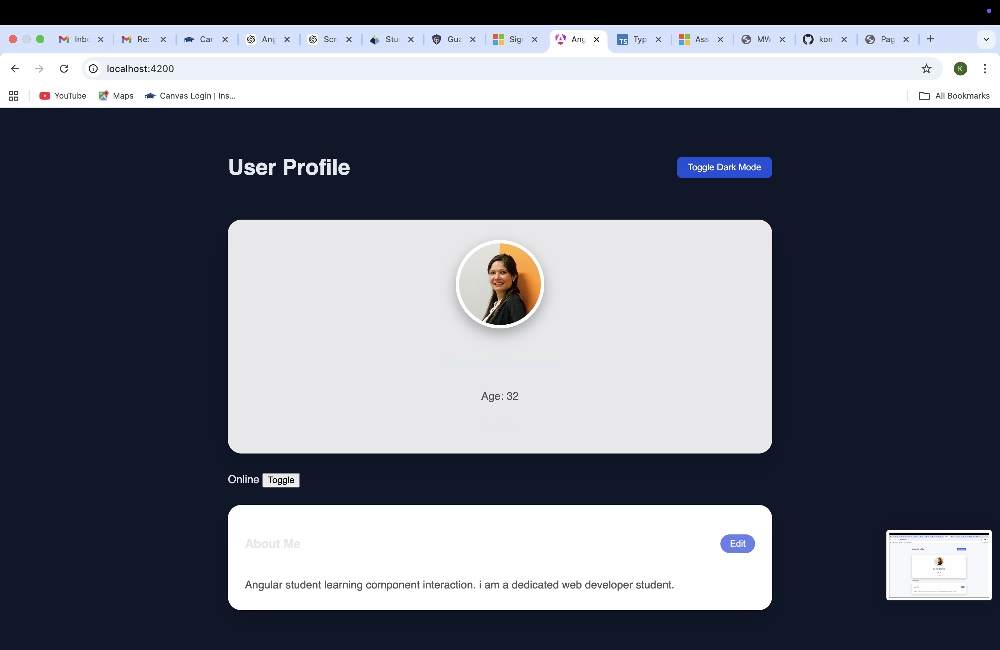
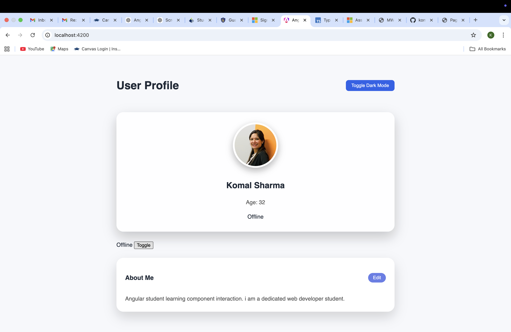
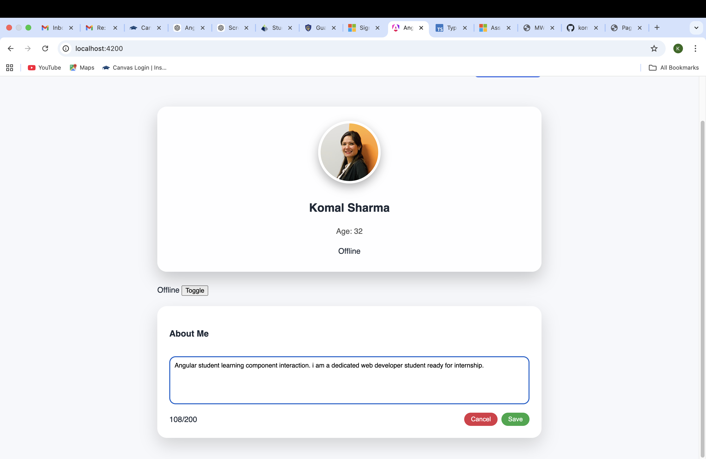
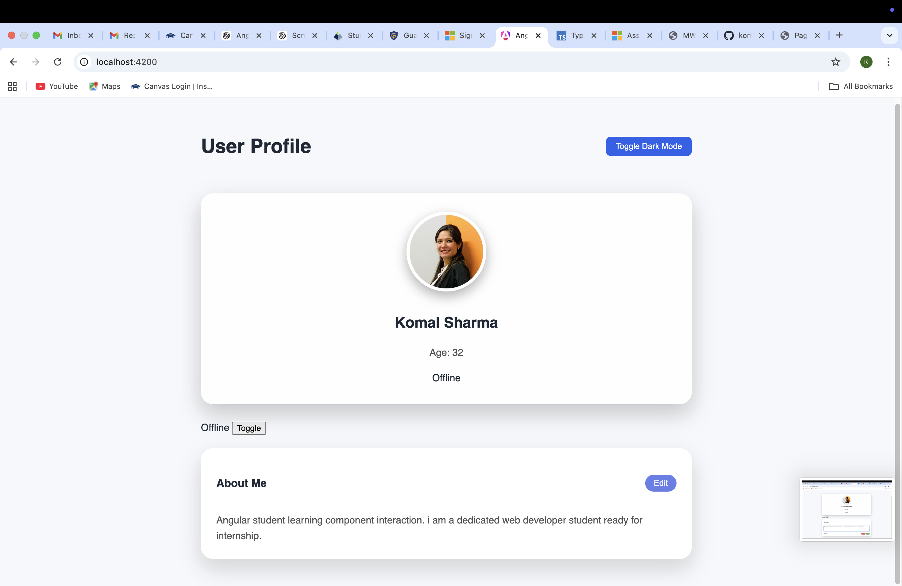

# AngularApp1 – User Profile Dashboard

A modern Angular application that demonstrates component-based architecture, input/output communication, and professional UI design inspired by GitHub.

## 🚀 Features

- User Profile Dashboard
- UserCardComponent (Displays name, age, profile image)
- UserStatusComponent (Toggle online/offline status)
- UserBioComponent (Editable bio section)
- Component interaction using @Input and @Output
- TypeScript interface for user modeling
- Dark mode toggle

## 🛠 Tech Stack

- Angular (Standalone Components)
- TypeScript
- HTML5
- CSS3
- Git & GitHub

## 📚 Concepts Demonstrated

- Component Interaction
- EventEmitter
- Two-way binding (ngModel)
- Encapsulated component styles
- Angular CLI project structure
- Version control using Git

## 📸 Preview

## 🔗 Live Demo

working on it.

